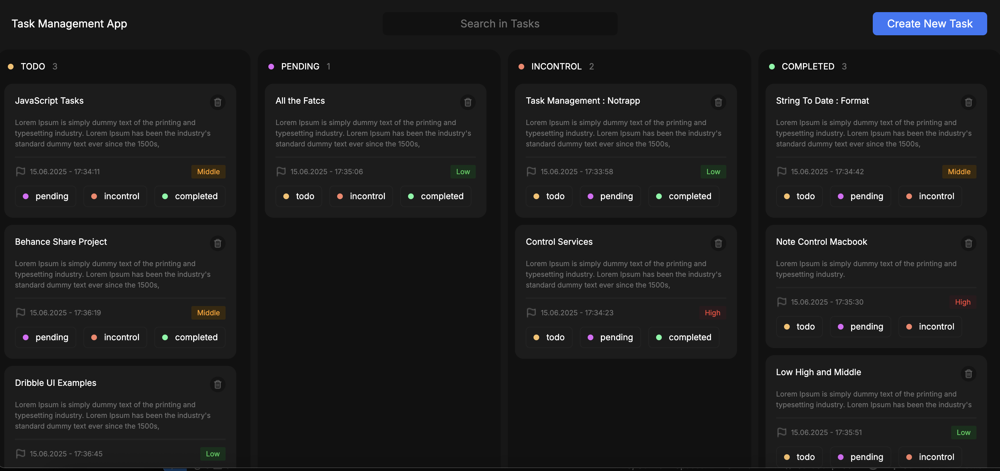

# ✅ React Todo Uygulaması

Bu proje, React ile geliştirilmiş kapsamlı bir Todo uygulamasıdır. Kullanıcılar görevlerini ekleyebilir, öncelik ve durum atayabilir, arama yapabilir ve görevleri yönetebilir.

## 🚀 Özellikler

- ✅ Görev Ekleme
- ⚠️ Önem Seviyesi Belirleme (Low, Middle, High)
- 🔄 Durum Belirleme (Todo, Pending, In Control, Completed)
- ❌ Görev Silme
- 🔍 Görevler Arasında Arama Yapma

## 🛠️ Kullanılan Teknolojiler

- React
- JavaScript (ES6+)
- CSS / Tailwind

## 📸 Ekran Görüntüleri



## 🔧 Kurulum

1. Depoyu klonla:

```bash
git clone https://github.com/kullanici-adi/todo-app.git
cd todo-app
```
